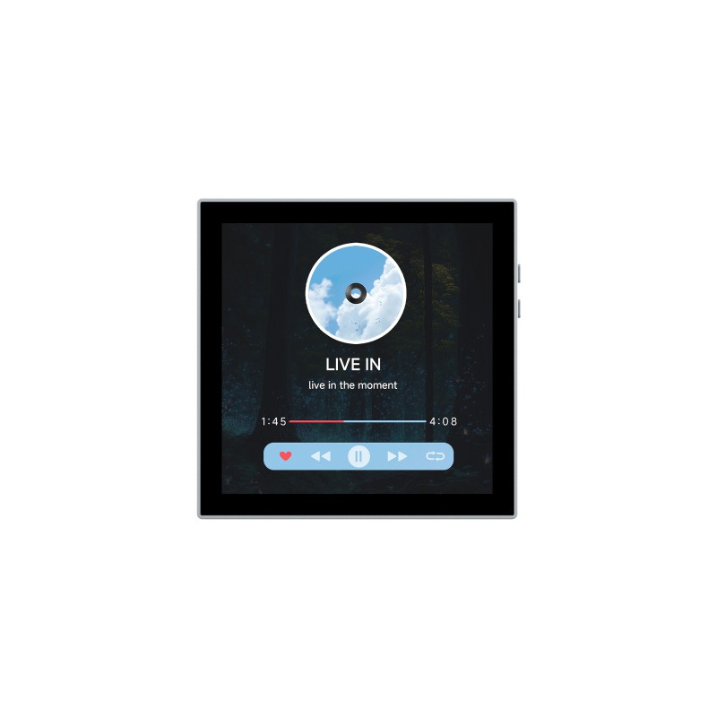

<div align="center">
  <h1>ESP32-P4-WIFI6-Touch-LCD-4B</h1>
  <strong>Source examples, board references, and maintained firmware boundaries for the Waveshare 4-inch ESP32-P4 product.</strong>
  <p>
    <a href="https://github.com/waveshareteam/ESP32-P4-WIFI6-Touch-LCD-4B/actions/workflows/repository-policy.yml"></a>
    <a href="https://github.com/waveshareteam/ESP32-P4-WIFI6-Touch-LCD-4B/actions/workflows/esp-idf.yml"></a>
    <a href="https://github.com/waveshareteam/ESP32-P4-WIFI6-Touch-LCD-4B/actions/workflows/arduino.yml"></a>
    <a href="https://github.com/waveshareteam/ESP32-P4-WIFI6-Touch-LCD-4B/actions/workflows/firmware.yml"></a>
  </p>
  <p></p>
  <p><strong>English</strong> · <a href="README_ZH.md">简体中文</a></p>
  <p>
    <a href="https://www.waveshare.com/esp32-p4-wifi6-touch-lcd-4b.htm">🌐 Product</a> ·
    <a href="https://docs.waveshare.com/ESP32-P4-WIFI6-Touch-LCD-4B">📚 Documentation</a> ·
    <a href="docs/firmware.md">📦 Firmware</a> ·
    <a href="docs/getting-started.md">🚀 Quick start</a> ·
    <a href="examples/esp-idf/README.md">🧩 ESP-IDF</a> ·
    <a href="examples/arduino/README.md">🔧 Arduino</a>
  </p>
</div>

---

This repository normalizes the first-party ESP-IDF and Arduino examples from
the product resource package. The maintained ESP-Brookesia source remains a
separate firmware surface. Reusable display, touch, audio, and board support
for new ESP-IDF applications should resolve through the published
[`waveshare/esp32_p4_wifi6_touch_lcd_4b` 3.0.0 BSP](https://components.espressif.com/components/waveshare/esp32_p4_wifi6_touch_lcd_4b/versions/3.0.0).
The GT911 address-probe fix is queued as BSP 3.0.1; this product stays on 3.0.0
until that version is published in the Component Registry, without Git URL
dependencies.

## 🖥️ Hardware scope

The standalone ESP32-P4-WIFI6-Touch-LCD-4B combines an ESP32-P4, 32 MB flash,
32 MB PSRAM, a 4-inch 720 × 720 ST7703 two-lane MIPI DSI display, GT911 touch,
audio codecs, camera and MicroSD interfaces, USB, and an ESP32-C6 wireless
coprocessor.

The related ESP32-P4-86-Panel-ETH-2RO is a different product assembly. Its
bottom board provides IP101 Ethernet, two relays, and RS485; examples for those
interfaces require the complete matching assembly and are not standalone 4B
features. Review [`docs/board.md`](docs/board.md) and
[`schematic/README.md`](schematic/README.md) before changing pins or carrying
assumptions across hardware revisions.

The Registry BSP 3.0.0 used by the ESP-IDF examples and maintained firmware
configures a 480 Mbps DSI lane rate. The Arduino helper imported from the
product archive also uses 480 Mbps, but that agreement is a software
configuration rather than hardware-validation evidence. Revalidate the display
on the intended board revision before changing either implementation.

## 🗂️ Repository layout

| Path | Purpose |
| --- | --- |
| `examples/esp-idf/` | Thirteen normalized first-party ESP-IDF projects |
| `examples/arduino/` | Five first-party Arduino sketches and one product helper library |
| `firmware/brookesia/` | Maintained ESP-Brookesia source firmware; not an example-CI target |
| `config/` | Shared ESP-IDF configuration defaults |
| `docs/` | Board, source, CI, firmware, and licensing notes |
| `hardware/` | Mechanical and dimensional references |
| `schematic/` | Main-board and bottom-board schematics |
| `releases/` | Firmware-package format and retrieval instructions |
| `.github/` | Continuous integration and contribution templates |

The complete example lists are in
[`examples/esp-idf/README.md`](examples/esp-idf/README.md) and
[`examples/arduino/README.md`](examples/arduino/README.md).

## 🧪 Framework matrix

The pinned default matrix was rechecked against stable upstream releases on
2026-08-10:

| Surface | Maintained version | Default Actions coverage | Runtime boundary |
| --- | --- | ---: | --- |
| 13 ESP-IDF examples | ESP-IDF v5.5.5 and v6.0.2 | 26 builds | Compile evidence only |
| 5 Arduino sketches | Arduino-ESP32 3.3.11 | 5 compiles | Compile evidence only |
| Brookesia firmware | ESP-IDF v5.5.5 | Separate from default example CI | IDF v6 remains pending |

CI first classifies the complete changed-file scope. Direct example changes
select only the affected project, shared build inputs select the complete
framework matrix, and documentation-only changes retain a visible routing job
without rebuilding firmware. Firmware changes are reported but never silently
reclassified as examples. See [`docs/ci.md`](docs/ci.md) for the exact contract.

A successful compile is not hardware validation. Wi-Fi additionally requires a
compatible image on the ESP32-C6 coprocessor, which is not included in the
official example archive. See
[`docs/p4-c6-hosted-wifi.md`](docs/p4-c6-hosted-wifi.md).

## 🚀 Quick start

Activate an explicit ESP-IDF environment before building an example:

```sh
idf.py --version
idf.py -C examples/esp-idf/hello_world set-target esp32p4
idf.py -C examples/esp-idf/hello_world build
```

Brookesia uses its separately maintained IDF v5.5 boundary:

```sh
idf.py -C firmware/brookesia set-target esp32p4
idf.py -C firmware/brookesia build
```

Arduino builds use FQBN `esp32:esp32:esp32p4`, 32 MB flash, enabled PSRAM, and
the options in [`examples/arduino/README.md`](examples/arduino/README.md).
Complete build and flash guidance is in
[`docs/getting-started.md`](docs/getting-started.md).

## 📦 Source and firmware provenance

Official download URLs, archive hashes, and normalized directory mappings are
recorded in [`docs/sources.md`](docs/sources.md). CI-built packages and future
factory or recovery images are different artifact classes; see
[`docs/firmware.md`](docs/firmware.md). Generated build trees, dependency
caches, lock files, and release packages are intentionally excluded from source
control.

## 📄 License and redistribution

No repository-wide license has been selected. Individual files and components
may carry their own licenses, but those licenses do not grant a license for the
repository as a whole. Review [`docs/licensing.md`](docs/licensing.md) and
[`THIRD_PARTY_NOTICES.md`](THIRD_PARTY_NOTICES.md) before publishing or
redistributing imported source, binaries, media, schematics, or drawings. See
[`SUPPORT.md`](SUPPORT.md) for repository support boundaries.
