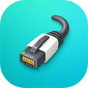
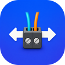

# ESP-Brookesia 出厂固件

[](https://github.com/espressif/esp-idf/releases/tag/v5.5.5)
[](https://www.espressif.com/zh-hans/products/socs/esp32-p4)
[](https://lvgl.io/)

[English](README.md) | 简体中文

本目录是 **Waveshare ESP32-P4-WIFI6-Touch-LCD-4B** 的出厂固件源码工程，并按后续公开维护的目标组织。
固件以 ESP-Brookesia 作为应用框架，为 720 x 720 触摸屏提供应用启动器，
并集成显示、触摸、音频、摄像头、SD 卡、以太网、继电器、RS485 以及
ESP32-C6 Hosted Wi-Fi。

> [!IMPORTANT]
> 这是板卡专用固件，并非通用 ESP-Brookesia 示例。请使用 ESP-IDF
> v5.5.5，并以工程清单中的固定组件版本为准。ESP32-P4 目标、分区表、
> BSP 版本和 ESP32-C6 从机固件共同构成兼容组合，修改后必须进行硬件验证。

## 平台基线

| 层级 | 当前工程基线 |
| --- | --- |
| 主控 | ESP32-P4，32 MB Flash，32 MB PSRAM |
| 显示 / 触摸 | 4 英寸 720 x 720 MIPI DSI ST7703 / GT911 |
| 开发框架 | ESP-IDF v5.5.5，`idf_component.yml` 要求 `>=5.5,<6.0` |
| UI | LVGL 9.4.0，本地 ESP-Brookesia core 0.6.0-beta2 |
| BSP | 内置 `waveshare/esp32_p4_wifi6_touch_lcd_4b` 3.0.0 快照；工程约束 Registry 标识为 3.0.0 |
| LVGL 适配 | `espressif/esp_lvgl_adapter` 0.6.2，不使用 `esp_lvgl_port` |
| 无线网络 | ESP32-C6 协处理器，通过 SDIO 运行 ESP-Hosted / `esp_wifi_remote` |
| 语音助手 | `espressif/esp_xiaozhi` 0.1.1、ESP-SR 2.4.7、xiaozhi-fonts 1.6.0 |

内置 BSP 与 ST7703 源码用于保留出厂固件的集成状态，因此会遮蔽同名托管组件。
独立示例使用已发布的 BSP 3.0.0。只有在完整比较并完成 Brookesia 上板验证后，
才能移除这些本地副本并完全切换到 Registry 版本。

内置的上游清单保留兼容版本范围；工程和组件层的精确约束会收窄当前
ESP-IDF v5.5.5 活动依赖图。生成的 `dependencies.lock` 因本地组件条目含主机
路径而保持忽略；提交验证证据时应另外记录其解析出的传递依赖版本。

硬件引脚和 P4/C6 兼容关系分别见
[`docs/board_ZH.md`](../../docs/board_ZH.md) 与
[`docs/p4-c6-hosted-wifi_ZH.md`](../../docs/p4-c6-hosted-wifi_ZH.md)。

## 硬件修订 profile

默认 profile 是 `rev1_3`：pre-v3 ESP32-P4，使用
`CONFIG_ESP32P4_SELECTS_REV_LESS_V3=y`、`CONFIG_ESP32P4_REV_MIN_100=y` 和
200 MHz PSRAM 基线。`rev3_x` 明确使用 `CONFIG_ESP32P4_SELECTS_REV_LESS_V3=n`，
最低版本为 3.0，并保留 250 MHz PSRAM。二者是独立且不兼容的二进制，不能交叉烧录。
CI 使用 `sdkconfig.defaults.rev1_3` 或 `sdkconfig.defaults.rev3_x`，各自拥有独立
SDKCONFIG/build 路径。v3.x profile 需要 ESP-IDF 5.5.3+ 或 6.0+，但编译成功不能证明
PCB/电气版本匹配或硬件运行正常。

## 应用列表

启动器会安装以下应用。下表直接引用生成 LVGL 资源时使用的源 PNG 图标。

<table>
  <tr>
    <td align="center"><br><b>AIChats</b></td>
    <td align="center"><br><b>Calculator</b></td>
    <td align="center"><br><b>DrawPanel</b></td>
    <td align="center"><br><b>SpecAnalyzer</b></td>
    <td align="center"><br><b>MusicPlayer</b></td>
    <td align="center"><br><b>Settings</b></td>
  </tr>
  <tr>
    <td align="center"><br><b>Camera</b></td>
    <td align="center"><br><b>VideoPlayer</b></td>
    <td align="center"><br><b>Ethernet</b></td>
    <td align="center"><br><b>Relay Control</b></td>
    <td align="center"><br><b>RS485</b></td>
    <td align="center"><br><b>Squareline</b></td>
  </tr>
</table>

| 应用 | 功能 | 运行依赖 |
| --- | --- | --- |
| AIChats | 网络检查、小智激活、WakeNet 唤醒、VAD、Opus 上下行、服务端文字与 TTS | Wi-Fi 或以太网、`model`/`storage` 镜像、ES7210/ES8311 |
| Calculator | 适合触摸屏操作的 Brookesia 计算器 | 显示和触摸 |
| DrawPanel | 固定画布区域，边缘绘制不会拖动整个应用 | 显示和触摸 |
| SpecAnalyzer | 两个前置麦克风的独立 FFT 频谱 | ES7210 TDM 输入 |
| MusicPlayer | 最多五首本地提供的 MP3，复用封面和频谱素材 | SPIFFS `storage`、ES8311 输出 |
| Settings | WLAN 扫描/连接、声音、屏幕亮度和设备信息子页面 | ESP32-C6 Hosted Wi-Fi 和板级服务 |
| Squareline | 由 Registry 安装的 Squareline Studio UI 演示与应用模板 | 显示和触摸 |
| Camera | PPA 裁剪/缩放的全屏 MIPI CSI 预览 | 支持的 OV5647 模式、`esp_video` |
| VideoPlayer | SD 卡全屏 AVI/MJPEG 播放，音频可用时同步播放 | SD 卡、JPEG/PPA、ES8311 输出 |
| Ethernet | IP101 链路、IPv4、掩码、网关、MAC、速率/双工和 PHY 信息 | IP101 与匹配的 86 面板底板 RJ45 通路 |
| Relay Control | GPIO32、GPIO46 两路高电平有效继电器，状态写入 NVS 并恢复 | 继电器输出和 NVS |
| RS485 | 定时发送、接收窗口、计数与清空功能 | UART1 和板载收发器 |

## 构建

### 环境要求

- 已安装 ESP-IDF v5.5.5 及 `esp32p4` 工具链。
- 首次解析依赖时，可以访问 ESP Component Registry 和固定的 Waveshare
  组件仓库。
- 烧录时准备 ESP32-P4-WIFI6-Touch-LCD-4B 和可传输数据的 USB 线。
- 为托管组件、SPIFFS 镜像和语音模型镜像预留足够磁盘空间。

先激活指定 ESP-IDF 环境，并显式确认版本：

```sh
idf.py --version
idf.py -C firmware/brookesia set-target esp32p4
idf.py -C firmware/brookesia build
```

`sdkconfig.defaults` 已配置 ESP32-P4、32 MB Flash、Hex PSRAM、720 x 720
面板、OV5647、ESP32-C6 Hosted 传输和“你好小智”WakeNet 模型。不要直接修改
`managed_components/` 中的文件；应修改组件清单，再由 IDF Component Manager
重新解析。

工程含本地组件时，Component Manager 生成的 `dependencies.lock` 会记录当前
机器的绝对组件路径，因此该文件只适合本地使用并已忽略。新环境可执行
`idf.py reconfigure` 或首次 `build` 重新生成；可复现的 BSP 提交和组件范围应
维护在各 `idf_component.yml` 中，公开发布物不要包含主机专用锁文件。

### 首次完整烧录与分区变更

首次安装必须同时写入 bootloader、分区表、应用、ESP-SR 模型和 SPIFFS 资源：

```sh
idf.py -C firmware/brookesia -p PORT flash monitor
```

调整分区偏移/大小、从旧分区布局升级，或怀疑模型/文件系统镜像残留时，先整片擦除：

```sh
idf.py -C firmware/brookesia -p PORT erase-flash flash monitor
```

当分区、语音模型和 `spiffs/` 均未变化时，日常代码迭代可只烧应用：

```sh
idf.py -C firmware/brookesia -p PORT app-flash monitor
```

`app-flash` **不会**更新 `srmodels.bin`、`storage.bin` 或分区表。修改
`partitions.csv`、WakeNet/模型 Kconfig、xiaozhi-fonts、内置音乐或提示音后，
必须重新执行完整 `flash`。

## Flash 分区与资源

虽然板卡使用 32 MB Flash，当前分区表有意结束于 16 MiB。这样可以减少完整
烧录的数据量，并在 Quad Flash 32 位寻址未启用时，将 ESP-SR 的 mmap 模型
保留在前 16 MiB。

| 分区 | 偏移 | 大小 | 用途 |
| --- | ---: | ---: | --- |
| `nvsfactory` | `0x009000` | 200 KiB | 出厂/配置 NVS |
| `nvs` | `0x03B000` | 840 KiB | 运行时 NVS，包含应用状态 |
| `otadata` | `0x10D000` | 8 KiB | OTA 选择信息 |
| `phy_init` | `0x10F000` | 4 KiB | PHY 初始化数据 |
| `model` | `0x110000` | 960 KiB | 自动生成的 ESP-SR `srmodels.bin` |
| `factory` | `0x200000` | 8 MiB | 主应用固件 |
| `storage` | `0xA00000` | 6 MiB | 自动生成的 SPIFFS 资源 |

不要把 `model` 简单移动到较大的 `factory` 或 `storage` 后方。若分区需要跨过
16 MiB，必须同步启用并验证本平台适用的 Flash MMAP/32 位地址配置。检测到
32 MB Flash 并不代表所有 mmap 使用方都能读取 16 MiB 以上的地址。

`storage.bin` 从 `spiffs/` 生成，构建时还会把 `78/xiaozhi-fonts` 的 30 px
通用字体放入 `/spiffs/xiaozhi/font.bin`。运行时资源包括：

- `/spiffs/music` 下最多五首由集成方提供的 MusicPlayer MP3；选择可再分发素材和许可证前保持忽略。
- `/spiffs/xiaozhi` 下的数字、激活和成功提示 OGG。
- 小智运行时加载到 PSRAM 的中英文通用字体。

## AIChats / 小智

AIChats 是 `components/XiaozhiApp` 在启动器中的名称。它以托管组件
`esp_xiaozhi` 处理协议，同时保留本板专用的 UI、激活、音频和生命周期适配。

### 首次使用流程

1. 打开 AIChats。应用先显示 UI，再在后台完成自检，不会等待全部网络和音频
   初始化后才显示页面。
2. 应用接受 WLAN Station 或 Ethernet 的有效 IPv4 地址。它不会自行启动配网
   Portal；请在 Settings 中配置 WLAN，或插入网线。
3. 设备尚未绑定小智账号时，屏幕显示并语音播报激活码。进入小智控制面板，
   添加设备并输入该代码。
4. 绑定成功后会播放本地 `success.ogg`，随后连接会话服务。
5. 页面显示待命后，说出已编译的唤醒词（默认“你好小智”），听到首轮回复后
   即可继续对话。

如果日志出现 `No speech model found` 或
`contains no compatible models`，请重新构建并完整烧录，确保分区表和
`srmodels/srmodels.bin` 均写入。仅烧应用无法修复模型分区。

### 编译期 UI 语言

本地状态文字默认使用英文，可通过以下菜单切换：

```text
idf.py menuconfig
  Xiaozhi Application
    Local UI language
      English
      Simplified Chinese
```

对应配置为 `CONFIG_XIAOZHI_APP_UI_LANGUAGE_ENGLISH` 和
`CONFIG_XIAOZHI_APP_UI_LANGUAGE_SIMPLIFIED_CHINESE`。该选项只控制固件自己的
状态文字和激活说明兜底文本；服务端返回的对话文字、TTS 和激活消息会原样
显示或播放，不会因为本地 UI 语言选项而翻译。

如需修改产品默认值，在 `sdkconfig.defaults` 中把 English 配置替换为
Simplified Chinese 配置，并确保 choice 中只有一项为 `y`。已有构建目录会
保留生成的 `sdkconfig`；修改 defaults 后应通过 `menuconfig` 选择，或重新
生成 `sdkconfig`。

新增或修改本地字符串时编辑
`components/XiaozhiApp/XiaozhiLocalization.*`，不要把服务端对话或激活消息
放入本地翻译表。

### 产品工具扩展入口

`components/XiaozhiApp/XiaozhiDeveloperTools.cpp` 中的
`registerXiaozhiDeveloperTools()` 是 MCP 产品工具入口。每次创建 MCP 引擎后、
启动传输前会调用一次；默认实现不注册任何工具。文件中的 TODO 已列出可扩展方向：

- 调节屏幕背光。
- 调节输出音量。
- 拍摄当前摄像头画面，用于视觉请求。

这里只应注册真正可调用的工具：创建 MCP schema 和回调、验证参数、加入引擎，
并返回硬件操作的真实结果。不要让 `tools/list` 暴露尚未实现的占位工具。耗时
硬件操作应投递给应用任务，避免阻塞协议回调；摄像头缓冲区必须复制或持有到
结果构建完成。

### 语音音频约定

AIChats 会把板级音频总线配置为 24 kHz，提取两个麦克风和一路回声参考，
重采样到 16 kHz 后按 `MMR` 顺序交给 ESP-SR。Opus 上行使用 16 kHz；
服务端下行音频在必要时转换为设备的 24 kHz 播放采样率。

| ES7210 串行 TDM 槽位 | 板上实测来源 | 用途 |
| ---: | --- | --- |
| 0 | 物理 MIC1 | SpecAnalyzer 左声道；AIChats 麦克风 1 |
| 1 | 物理 MIC3 | AIChats 回声参考 |
| 2 | 物理 MIC2 | SpecAnalyzer 右声道；AIChats 麦克风 2 |
| 3 | 物理 MIC4 | 保留在完整帧中，当前应用未使用 |

TDM 槽位掩码与 ES7210 物理麦克风增益掩码属于不同命名空间，不能互相代用。
SpecAnalyzer 会先读取完整四槽帧，再由软件提取槽位 0 和 2；诊断日志固定输出
`TDM peaks [MIC1, MIC3(echo), MIC2, MIC4]`。

## 硬件应用说明

### 继电器状态恢复

Relay Control 在 NVS 命名空间 `relay_control` 的 `output_state` 键中保存两位
状态。应用初始化阶段会在主板重启后恢复 GPIO32/GPIO46；每次打开 UI 时也会读取
当前 GPIO，因此杀掉后台再进入不会把开关显示重置为关闭。主动擦除 NVS 后，两路
输出回到默认关闭状态。

### 以太网

Ethernet 应用启动 IP101（PHY 地址 1）和 DHCP，并显示链路、IPv4、掩码、
网关、MAC、速率/双工以及 PHY 信息。引脚属于 `components/bsp_extra` 中的产品
专用适配，详见 [`docs/board_ZH.md`](../../docs/board_ZH.md)。

### RS485

终端使用 UART1、115200 8N1，TX GPIO47、RX GPIO48。默认开启自动发送，每秒发送：

```text
Hi,this is Waveshare ESP32-P4-WIFI6-Touch-LCD-4B!
```

接收窗口会转义不可打印字节，并显示发送帧数和接收字节数。当前产品文档说明
RS485 使用自动方向控制；已审核的历史 V1.3 底板原理图则把 `/RE` 与 `DE` 相连并
上拉，因此该特定修订可能无法接收。不得把 V1.3 限制泛化到当前底板。不要把 A、B
直接短接做回环，这会破坏差分总线。

## 摄像头与媒体要求

### Camera

默认配置为 OV5647 MIPI RAW8 800 x 800、50 FPS。Camera 打开 MIPI CSI V4L2
设备，保留传感器节点返回的原始宽高，只在需要时请求兼容的 LCD 色彩格式，再用
PPA 居中裁剪并缩放到 720 x 720。若 CSI 模式不接受修改尺寸，不要强制把
`VIDIOC_S_FMT` 设为 720 x 720 或其他屏幕尺寸。

### VideoPlayer

VideoPlayer 挂载 SD 卡后只扫描 `/sdcard/avi`。文件名没有额外要求，`.avi`
扩展名不区分大小写；SD 根目录中的 AVI 和 MP4 都不会被当前逻辑枚举。播放器把
AVI/MJPEG 画面解码为全屏显示，循环播放目录中的文件；音频初始化成功时同步输出
AVI 音频，失败时继续静音播放画面。

### MusicPlayer

MusicPlayer 枚举 `/spiffs/music` 中最多五首由集成方提供的 MP3，UI 会复用三套
封面和频谱素材。示例 MP3 在确定可再分发素材及许可证前保持忽略，因此公开仓库的
干净检出可能没有曲目。发布前应加入已获准分发的音频，或说明集成方如何提供资源。
替换或增加曲目后必须重新生成并烧录 `storage.bin`，只执行 `app-flash` 不会
生效。

## 工程结构

| 路径 | 职责 |
| --- | --- |
| `main/main.cpp` | 板卡启动、Loading UI、Phone Shell、应用安装和状态事件 |
| `components/brookesia_core/` | 本地 Brookesia 应用框架与 Phone UI |
| `components/bsp_extra/` | 音频、背光、继电器、IP101、RS485 的产品专用适配 |
| `components/XiaozhiApp/` | AIChats UI、激活、音频管线、协议适配和 MCP 扩展入口 |
| `components/HardwareApps/` | Relay、Ethernet、RS485 三个硬件应用 |
| `components/<App>/` | 各启动器应用及编译资源 |
| `spiffs/` | 生成 `storage` 分区镜像的源资源 |
| `archive/` | 不参与当前安装的历史实现，仅供参考 |
| `partitions.csv` | 出厂固件分区表 |
| `sdkconfig.defaults` | 共用的维护工程默认配置 |
| `sdkconfig.defaults.rev1_3` / `.rev3_x` | 互斥的芯片/PSRAM 覆盖配置 |
| `managed_components/` | Component Manager 生成目录，不要直接编辑 |
| `build/` | 构建产物，不属于源码 |

## 新增应用

基础生命周期可参考体积较小的 `brookesia_app_calculator`；需要后台任务和共享硬件
时，可参考 `HardwareApps` 或 `XiaozhiApp`。

1. 新建 `components/<AppName>/`，包含 `CMakeLists.txt`、`idf_component.yml`、
   头文件、实现和 `assets/`。
2. 继承 `esp_brookesia::systems::phone::App`，必须实现 `run()` 和 `back()`。
   再根据应用持有的资源按需覆盖 `init()`、`deinit()`、`close()`、`pause()`、
   `resume()` 和 `cleanResource()`。
3. LVGL 对象必须在 LVGL 线程中创建/修改，或仅在很短的显示锁范围内访问。
   后台任务发布数据，再由 timer/async 回调更新 UI。
4. 除编译后的 LVGL 图标外，保留源 PNG，方便审核启动器效果和文档引用。
5. 第三方依赖写入组件清单，不要复制托管组件源码。
6. 在 `main/main.cpp` 中获取单例并调用 `phone->installApp()`，或对适合的应用
   使用现有 Registry 机制。
7. 验证反复打开、切后台、恢复、关闭和重启。释放应用拥有的 timer、task、
   queue、codec session、SD handle 和 LVGL object。

## 常见问题与易踩坑点

- **长时间持有 LVGL 锁会让动画停住。** 显示锁只能包围 UI 操作；网络、SD
  扫描、音频初始化、NVS、模型加载和应用构造必须在锁外进行。
- **应用编译成功不代表数据镜像已更新。** 模型、字体、提示音、音乐和分区变化
  需要完整 `flash`。
- **模型分区位置敏感。** 未在本板启用并验证 Flash MMAP/32 位寻址前，保持
  ESP-SR 模型在 16 MiB 以下。
- **ES7210 名称不是 DMA 槽位号。** 使用实测的
  `[MIC1, MIC3(echo), MIC2, MIC4]` 串行顺序，并区分物理增益掩码与 TDM 掩码。
- **多个音频应用共享同一物理总线。** 在语音、音乐和视频间切换时应停止或移交
  codec session，不要由多个应用独立重配成对的 I2S 通道。
- **摄像头尺寸由传感器模式决定。** 面向屏幕做裁剪/缩放，不要假设 CSI 节点
  接受 LCD 宽高。
- **VideoPlayer 仅支持当前 AVI 路径。** 使用 `/sdcard/avi/*.avi`；当前不支持
  MP4 枚举/播放。
- **P4 本身没有 Wi-Fi。** Host 组件必须与 ESP32-C6 中运行的从机固件兼容；
  只升级 P4 依赖可能出现“能编译但无线不可用”。
- **BSP 内置 3.0.0 快照。** 它会遮蔽已发布的托管组件，以保留导入时的
  Brookesia 集成状态。替换或升级前应与 Registry 版本完整比较，重点确认
  `esp_lvgl_adapter` 接口兼容性。
- **RS485 接收取决于硬件版本。** 软件排障前先检查收发器方向引脚。

## 诊断开关

`main/main.cpp` 中 `EXAMPLE_SHOW_MEM_INFO = false` 默认关闭周期 SRAM/PSRAM
统计。排查内存压力时可临时启用，原有诊断逻辑仍然保留。

反馈问题时，建议提供第一个真实错误、分区/模型加载行、Camera V4L2 格式、
Ethernet 链路事件或四路 ES7210 peak，同时注明板卡版本、ESP-IDF 版本和完整
复现步骤。

## 贡献、支持与发布检查

提交修改前请阅读仓库级[贡献指南](../../CONTRIBUTING_ZH.md)和
[支持说明](../../SUPPORT_ZH.md)。可复用的 BSP/驱动修复应尽量提交到对应上游组件，
本工程只保留产品组合和板级专用适配。仓库目前没有对外声明已经核实的私密漏洞报告
入口，因此不要在公开 Issue 中填写未公开的安全细节。

本地 Brookesia core 保留其
[Apache-2.0 许可证](components/brookesia_core/license.txt)。该许可证仅适用于对应
组件，不等于已经为整个仓库选择许可证。

发布前至少完成：

- 在干净源码环境中使用目标 ESP-IDF 版本重新解析依赖并构建。
- 完整烧录并验证显示/触摸、两个麦克风、喇叭、Wi-Fi、以太网、Camera、
  SD/Video、继电器、RS485 硬件限制，以及小智激活和完整唤醒/对话/结束流程。
- 记录兼容的 ESP32-C6 Hosted 从机固件版本。
- 发布完整烧录文件集合，而不是只有应用 `.bin`。
- 删除构建产物，并检查公开文本中不存在本机路径、用户名、凭据、激活标识和
  Wi-Fi 密码。
- 公开分发前选择并添加仓库级 `LICENSE.txt`，同时保留所有组件许可证、SPDX
  头和第三方 Notice。在仓库许可证确定前，不能把任一组件许可证当作整个仓库的
  授权声明。
